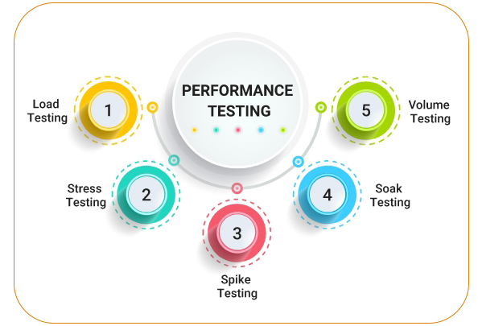

# Testing Implementation


## Overview

:::info Overview
`Test` là từ một quá ư khá gần gũi với chúng ta rồi. Làm cái tính năng nào mà không test kỹ thì người cực nhất là người đi làm cho cái tính năng đó đúng trở lại (hoặc là người đến sau, hoặc người đó không ai khác là bạn 😁).
:::


## Unit Test

:::info Unit Test Là gì?
Unit Test là một loại kiểm thử phần mềm trong đó các đơn vị hay thành phần riêng lẻ của phần mềm được kiểm thử. Kiểm thử đơn vị được thực hiện trong quá trình phát triển ứng dụng

- Một Unit là một thành phần nhỏ nhất mà ta có thể kiểm tra được như các hàm (**Function**), thủ tục (**Procedure**), lớp (**Class**), hoặc các phương thức (**Method**).
- Mỗi UT sẽ gửi đi một thông điệp và kiểm tra câu trả lời nhận được đúng hay không, bao gồm:
  - Các kết quả trả về mong muốn
  - Các lỗi ngoại lệ mong muốn

:::

## End-to-end Test

:::info End-to-end Test Là gì?
Kiểm thử End to End **(E2E)** là một phương pháp kiểm thử phần mềm để kiểm tra luồng ứng dụng từ đầu đến cuối. Nó được thực hiện từ đầu đến cuối trong các tình huống thực tế như giao tiếp của ứng dụng với phần cứng, mạng, cơ sở dữ liệu và các ứng dụng khác.

Lý do chính để thực hiện thử nghiệm này là để xác định sự phụ thuộc lẫn nhau của một ứng dụng cũng như đảm bảo rằng thông tin được truyền đạt giữa các thành phần hệ thống khác nhau là chính xác. Nó thường được thực hiện sau khi toàn bộ chức năng và hệ thống của ứng dụng đã được kiểm thử.

:::

:::warning Notes
Những rủi ro lớn có thể tránh được và có thể được kiểm soát:

- Kiểm tra và thực hiện xác minh luồng hệ thống
- Tăng phạm vi bao phủ thử nghiệm của tất cả các `sub-system` liên quan đến hệ thống phần mềm
- Cố gắng phát hiện các vấn đề nếu có với các `sub-system`

Dưới đây là một số hoạt động được bao gồm trong quá trình End to End testing :

- Nghiên cứu kỹ lưỡng các yêu cầu để thực hiện thử nghiệm
- Thiết lập các môi trường thử nghiệm thích hợp
- Nghiên cứu kỹ lưỡng các yêu cầu về `Phần cứng` và `Phần mềm`.
- Mô tả tất cả các `sub-system` cũng như hệ thống phần mềm chính có liên quan.
- Liệt kê các vai trò và trách nhiệm đối với tất cả các hệ thống và `sub-system` có liên quan.
- Các phương pháp được sử dụng trong thử nghiệm này cũng như các tiêu chuẩn được tuân theo, cùng với mô tả của nó.
- Thiết kế các trường hợp kiểm thử cũng như theo dõi các yêu cầu
- Ghi lại hoặc lưu dữ liệu đầu vào và đầu ra cho mỗi hệ thống.

:::

## Lib/framework support

### 1. JestJS

- Home page: https://jestjs.io/
- Một sản phẩm của **Facebook**
- Delightful JavaScript Testing:

  - 👩🏻‍💻 Developer Ready: A comprehensive JavaScript testing solution. Works out of the box for most JavaScript projects.

  - 🏃🏽 Instant Feedback: Fast, interactive watch mode only runs test files related to changed files.

  - 📸 Snapshot Testing: Capture snapshots of large objects to simplify testing and to analyze how they change over time.

- Github **(39K star)**: https://github.com/facebook/jest

### 2. Cypress

- Home page: https://www.cypress.io/
- Fast, easy and reliable testing for anything that runs in a browser.
- Github **(~39K star)**: https://github.com/cypress-io/cypress

### 3. Truffle

:::info Truffle overview
A world class development environment, testing framework and asset pipeline for blockchains using the Ethereum Virtual Machine (EVM), aiming to make life as a developer easier. With Truffle, you get:

- Built-in smart contract compilation, linking, deployment and binary management.
- Automated contract testing for rapid development.
- Scriptable, extensible deployment & migrations framework.
- Network management for deploying to any number of public & private networks.
- Package management with EthPM & NPM, using the ERC190 standard.
- Interactive console for direct contract communication.
- Configurable build pipeline with support for tight integration.
- External script runner that executes scripts within a Truffle environment.

:::

- Home page: https://trufflesuite.com/
- Github **(13K star)**: https://github.com/trufflesuite/truffle

### 4. MochaJS

- Home page: https://mochajs.org/
- Simple, flexible, fun JavaScript test framework for Node.js & The Browser.
- Mocha is a feature-rich JavaScript test framework running on Node.js and in the browser, making asynchronous testing simple and fun. Mocha tests run serially, allowing for flexible and accurate reporting, while mapping uncaught exceptions to the correct test cases
- Github **(21K star)**: https://github.com/mochajs/mocha

### 5. Selenium

:::info Selenium Overview

Selenium is an umbrella project encapsulating a variety of tools and libraries enabling web browser automation. Selenium specifically provides an infrastructure for the W3C WebDriver specification — a platform and language-neutral coding interface compatible with all major web browsers.

:::

- Home page: https://www.selenium.dev/
- Primarily it is for automating web applications for testing purposes, but is certainly not limited to just that.
- Boring web-based administration tasks can (and should) also be automated as well.
- Github **(~24K star)**: https://github.com/seleniumhq/selenium

### 6. Puppeteer

- Home page: https://pptr.dev/
- Là một sản phẩm của **Google**
- Headless Chrome Node.js API
- Github **(78K star)**: https://github.com/puppeteer/puppeteer

### 7. Cucumber

- Home page: https://cucumber.io/
- Cucumber is a tool for running automated tests written in plain language. Because they're written in plain language, they can be read by anyone on your team. Because they can be read by anyone, you can use them to help improve communication, collaboration and trust on your team.
- Github: https://github.com/cucumber

## Structure Testing implementation of me

```
.root folder (__test__)
├── components
│   ├── PSearch.test.jsx
│   ├── PTag.test.jsx
│   ├── ...
│   └── __snapshots__
├── config.js
├── utils
│   ├── ArrayUtil.test.js
│   ├── ObjectUtils.test.js
│   ├── StringUtils.test.js
│   ├── TimeUtils.test.js
│   └── UrlUtils.test.js
│   └── ...
├── global-context.js
├── services
│   ├── DataTransferService.test.js
│   └── URLService.test.js
├── supports
│   └── callApi.js
│   └── ...
├── mocks
```

## Notes

### Functional Software Testing Types


### Software Performance Testing



### Data Driven Framework


