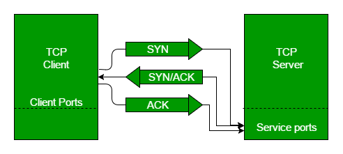
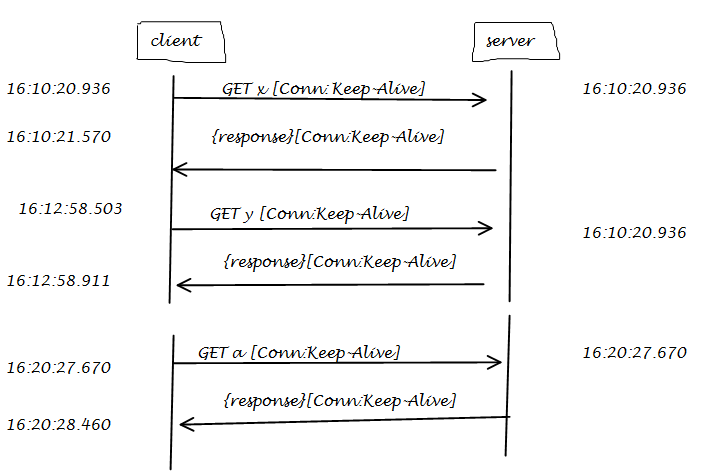
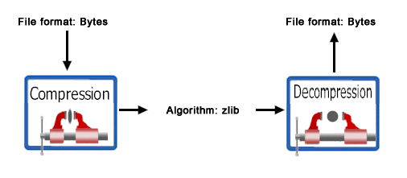
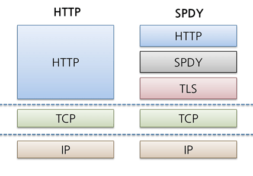
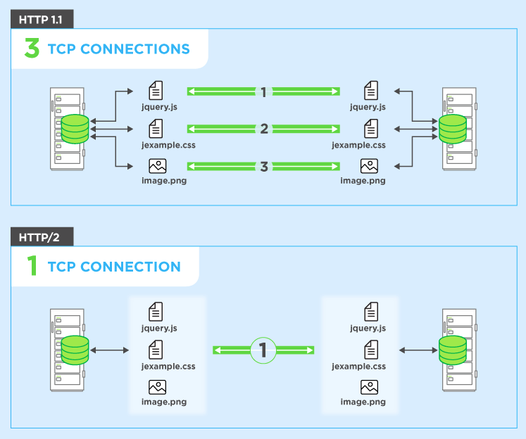
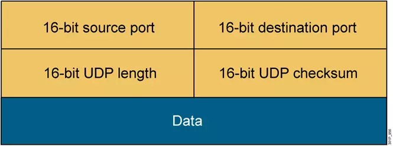

import Tabs from '@theme/Tabs';
import TabItem from '@theme/TabItem';

# Network

## Network Layer


:::info Physical - Bit
- It is concerned with transmitting raw bits over a communication channel.
- Chooses which type of transmission mode is to be selected for the transmission. The available transmission modes are Simplex, Half Duplex and Full Duplex.,
:::

:::info Data Link - Frame
- The main task of this layer is to transform a raw transmission facility into a line that appears free of undetected transmission errors.
- It also allows detecting damaged packets using the CRC (Cyclic Redundancy Check) error-detecting, code.
- When more than one node is connected to a shared link, Data Link Layer protocols are required to determine which device has control over the link at a given time.
- It is implemented by protocols like CSMA/CD, CSMA/CA, ALOHA, and Token Passing.
:::

:::info Network - Packet
- It controls the operation of the subnet.
- The network layer takes care of feedback messaging through ICMP messages.
:::

:::info Transport - TPDU - Transaction Protocol Data Unit
- The basic functionality of this layer is to accept data from the above layers, split it up into smaller units if needed, pass these to the network layer, and ensure that all the pieces arrive correctly at the other end.
- The Transport Layer takes care of Segmentation and Reassembly.
:::

:::info Session - SPDU - Session Protocol Data Unit
- The session layer allows users on different machines to establish sessions between them.
- Dialogue control is using the full-duplex link as half-duplex. It sends out dummy packets from the client to the server when the client is ideal.
:::

:::info Presentation - PPDU - Presentation Protocol Data Unit
- The presentation layer is concerned with the syntax and semantics of the information transmitted.
- It translates a message from a common form to the encoded format which will be understood by the receiver.
:::

:::info Application - APDU - Application Protocol Data Unit
- It contains a variety of protocols that are commonly needed by users.
- The application layer sends data of any size to the transport layer.
:::


## Protocol

## HTTP & HTTPS
:::info Hyper Text Transfer Protocol (Secure)
=> Là một giao thức truyền tải siêu văn bản
=> HTTPS => có gắn thêm lớp bảo mật => SSL (Secure Sockets Layer)
:::


HTTPS hoạt động tương tự như HTTP nhưng được bổ sung thêm SSL và giao thức TSL

Một số port: Để gửi và nhận email được thực hiện qua Port 25, giao thức truyền tải file thực hiện qua Port 21. Còn HTTP sử dụng Port 80 trong khi HTTPS là Port 443.

### HTTP hoạt động như thế nào?
Thông thường mỗi HTTP Request sẽ sử dụng một kết nối TCP (TCP Connection). Các bước sẽ trải qua đại khái như sau:

- Phía client sẽ khởi tạo một kết nối TCP đến server.
- Sau khi kết nối thành công, client sẽ gởi request đến server.
- Server tiếp nhận request, tiến hành tìm kiếm và trả về cho client thông qua kết nối TCP ở bước 2.
- Client tiếp nhận response từ server.
- Client đóng kết nối TCP.
- Nếu client cần thêm các object từ server, mỗi object sẽ cần thực hiện lại các bước 1 đến 5.

## SSL/TLS
:::info SSL là Secure Sockets Layer (TLS là viết tắt của Transport Layer Security)
Hoạt động bằng cách dùng public/private key để tạo session key => mã hóa dữ liệu theo phiên người dùng

- Cần bảo mật thông tin cá nhân thì dùng
- Cần tăng sếp hạng SEO thì dùng
- Cần tăng độ tin cậy với client thì dùng
:::

SSL nó cho phép khách truy cập có thể truyền tải thông tin lên web server một cảnh bảo mật. Nó bảo mật mọi dữ liệu được truyền đi theo cách mà nó không thể bị xâm nhập bởi bên thứ ba như là hackers hay scammers.
Bạn có thể xem website có đang dùng SSL/TLS không bằng cách nhìn vào ô biểu tượng trên thanh địa chỉ của trình duyệt, nếu có khóa màu xanh có nghĩa là có chứng chỉ SSL/TLS. Và bạn có thể click vào đó để xem chứng chỉ đó thuộc về ai.
SSL/TLS có ảnh hưởng nhất định lên các yếu tố như bảo mật, tối ưu hóa tìm kiếm và có thể thực sự tạo ra sự khác biệt lớn so với các đối thủ. Dĩ nhiên, đây không phải là phương pháp SEO mạnh, bạn nên sử dụng chứng chỉ SSL/TLS vì trên thực tế nó chỉ có lợi chứ không có hại, chứ đừng dùng nó chỉ để tăng hạng lên trình tìm kiếm.

## HTTP 1.1 & HTTP 2.0
### Overview

:::info
Thông thường mỗi HTTP Request sẽ sử dụng một kết nối TCP (TCP Connection). Các bước sẽ trải qua đại khái như sau:
1. Phía client sẽ khởi tạo một kết nối TCP đến server.
2. Sau khi kết nối thành công, client sẽ gởi request đến server.
3. Server tiếp nhận request, tiến hành tìm kiếm và trả về cho client thông qua kết nối TCP ở bước 2.
4. Client tiếp nhận response từ server.
5. Client đóng kết nối TCP.
6. Nếu client cần thêm các object từ server, mỗi object sẽ cần thực hiện lại các bước 1 đến 5.
:::


Ở đây chúng ta cần lưu ý rằng, bản chất TCP Connection khi được thiết lập sẽ cần 3 bước được biết đến với tên gọi: TCP 3-Way Handshake Process. Tức là giữa client và server cần trao đổi (gởi và nhận) 3 messages trước khi kết nối được thiết lập. Tương tự khi kết nối đóng lại cũng cần thực hiện lại quy trình 3 bước này.



### Giao thức HTTP/1 (v1.1)
Giao thức HTTP sau đó được phát triển lên HTTP/1 (version 1.1) vào năm 1999. HTTP chính thức được sử dụng rộng rãi hơn rất nhiều vì không những cho Web mà còn cả các đầu thiết bị khác.
HTTP/1 hỗ trợ nhiều method hơn **_(GET , HEAD , POST , PUT , DELETE , TRACE , OPTIONS)_**, có HEADER và quan trọng nhất đó là TCP Connection có thể được giữ lại (keep-alive hay persistent connection) để phục vụ các request tiếp theo.

### HTTP Pipelining
Đây là tính năng giúp HTTP 1.1 có thể tận dụng được một connection cho nhiều request. Phía client cứ gọi liên tiếp các request mà không cần đợi response. Server sẽ nhận một loạt các request này để xử lý rồi trả về sau.


:::warning
Tuy nhiên cơ chế này mang đến một phiền phức khác. Giả sử nếu các request đến đồng thời và xử dụng chung một connection, các response trả về không theo thứ tự sẽ khiến client không thể phân biệt được response nào của request nào. Vì thế quy tắc là request thứ tự ra sao thì phải trả về đúng theo thứ tự đó.

Thêm vào đó, nếu request có gói tin bị thất lạc (có thể là do gói tin lớn hoặc chất lượng đường truyền kém) sẽ khiến toàn bộ các request đang nối đuôi theo sau bị chặn lại cho tới khi request đó được giải quyết. Vấn đề này được biết với tên TCP Head-of-line blocking (HOL).
:::

### HTTP persistent connection (HTTP keep-alive)
Thay vì gởi một lượt các request vào một connection rồi đợi về một mớ response lộn xộn. Chúng ta có thể dùng HTTP keep-alive để gởi từng cặp request/response.



Ở đây có thể là một connection hoặc nhiều connection được tái sử dụng. Đây là giải pháp mà hầu hết các server đang áp dụng cho HTTP 1.1

### Hỗ trợ Compression/Decompression (Encoding)
Đây là chức năng cho phép Client và Server tối ưu được tốc độ và băng thông khi trao đổi thông tin. Cơ chế compress (nén) phổ biến nhất là gzip và Deflate.



### SPDY là gì?
:::info
SPDY (đọc là “speedy”) được phát triển bởi Google bắt đầu từ năm 2009 (v1) và 2012 (v2). Mục đích giao thức SPDY ra đời để tăng tốc độ tải trang và tính bảo mật cho website.
:::



:::info
Một số vấn đề từ HTTP/1 mà SPDY ra đời để giải quyết:
* **Single request per connection:** HTTP chỉ có thể tải về từng resource với từng request, mỗi cái là một connection tương ứng. Việc này gây làm tăng delay (thời gian chờ) cũng như không tận dụng được băng thông. SPDY cho phép một connection có thể xử lý được đồng thời nhiều request.
* **Client-initiated requests:** HTTP hoạt động theo kiểu “hỏi-đáp”, client request dữ liệu nào thì được server trả về dữ liệu nấy. Với SPDY, server có thể chủ động “push” dữ liệu về client mà không cần client gởi request đến.
* **Redundant headers:** HTTP headers là những metadata mô tả cách thức vận hành của một request HTTP. Trong nhiều trường hợp, rất nhiều request với những header lập đi lập lại giống nhau. SPDY có thể loại bỏ những header không cần thiết này để giải lượng băng thông cần thiết.
* **Uncompressed data:** Compression (nén) sẽ giúp dữ liệu có dung lượng nhỏ hơn khi trao đổi thông tin, với HTTP thì nó là optional (không bắt buộc). SPDY bắt buộc sử dụng nén dữ liệu cho mọi request.
:::

### HTTP/2



#### HTTP/2 sử dụng binary thay cho dạng văn bản
Binary Protocol (giao thức nhị phân) sẽ hiệu quả hơn để phân tích (parse), gọn nhẹ hơn để giao tiếp và quan trọng nhất là chúng sẽ ít bị lỗi hơn so với dạng text (văn bản). Đơn giản là bởi vì dữ liệu nhị phân không cần xử lý những trường hợp như khoảng trắng, in hoa, xuống dòng, dòng trống, emoji,…

#### Request Response Multiplexing
Trong HTTP/1, cụ thể là Pipelining, khi client muốn tối ưu connection bằng cách thực hiện nhiều request một lượt rồi đợi response trả về. Điểm hạn chế chúng ta đã biết response phải đúng thứ tự so với request. Việc này gây hiện tượng HOL.
Để khắc phục việc này, HTTP/2 sử dụng Multiplexing cho cả Request và Response. Có thể tạm hiểu rằng chúng được định danh để biết được response nào của request nào. Từ đó chúng có thể hoạt động độc lập mà không cần tuân thủ thứ tự như trước. Trên thực tế phương thức này chia dữ liệu giữa Client và Server thành từng data frame xen kẽ. Phía nhận sẽ có nhiệm vụ “lắp ghép” chúng lại để có được toàn bộ dữ liệu hoàn chỉnh.


#### Streams & Stream Prioritization

Kết nối HTTP/2 sẽ bao gồm nhiều Stream (luồng dữ liệu). Các streams này chứa một dãy các Data Frame cần giao tiếp giữa client và server. Các Data Frame có thể được đặt xen kẽ bất kể chúng từ đâu đến. Mặc dù là vậy, thứ tự của Data Frame vẫn rất quan trọng và phía nhận sẽ phải xử lý theo đúng thứ tự này. Ở cả 2 phía nhận và gởi data đều có thể đóng hoặc khởi tạo một stream mới. Khi Stream mới được thiết lập, nó sẽ có ID là một số nguyên (integer).

HTTP/2 cho phép client cung cấp mức độ ưu tiên cho các luồng dữ liệu cụ thể (stream). Mặc phía server không bị ràng buộc phải tuân theo ưu tiên này, nhưng cơ chế này cho phép server tối ưu hóa việc phân bổ tài nguyên dựa trên các yêu cầu của người dùng cuối.

#### Stateful Header Compression
Trong lúc client thực hiện các request đến server sẽ có vô số các header bị dư thừa và lặp đi lặp lại. HTTP/2 sử dụng HPACK như một cách tiếp cập đơn giản và an toàn để compress (nén) các header này. Ở cả client và server đều phải lưu trữ các head đã được sử dụng trước đó, từ head đã được nén, chúng sẽ tra cứu thông tin và tiến hành khôi phục lại header đầy đủ. Việc này mang lại hiệu năng cao và tối ưu băng thông đáng kể.


#### Server Push
Trong HTTP/2 server có thể gởi về nhiều response với chỉ một request từ client. Cơ chế này gọi là Server Push, giúp trình duyệt tiết kiệm được các requests không cần thiết.


## TCP & UDP
:::info
- TCP: Transmission Control Protocol - cung cấp cho các ứng dụng cách để chuyển (và nhận) một luồng gói thông tin đã được đặt hàng và kiểm tra lỗi qua mạng.
- UDP: User Datagram Protocol - được các ứng dụng sử dụng để vận chuyển một luồng dữ liệu nhanh hơn bằng cách bỏ qua kiểm tra lỗi.
- Cả hai giao thức đều được xây dựng trên giao thức IP - Internet Protocol
:::


### Cấu trúc gói tin TCP


:::info
- Source port và destination port (đều dài 16 bit): được sử dụng để định danh cho session của giao thức nào đó trên lớp ứng dụng đang được truyền tải trong TCP segment đang xét
- Sequence number (32 bit): dùng để đánh số thứ tự gói tin (từ số sequence nó sẽ tính ra được số byte đã được truyền).
- Acknowledge number (32 bit): : dùng để báo đã nhận được gói tin nào và mong nhận được byte mang số thứ tự nào tiếp theo.
- Header length (4 bit): cho biết toàn bộ header dài bao nhiêu tính theo đơn vị word(1 Word = 4 byte).
- Các bit reserverd (4 bit): đều được thiết lập bằng 0
- Các bit control (9 bit): các bit dùng để điều khiển cờ (flag) ACK, cờ Sequence ...
- Window size (16 bit): số lượng byte được thiết bị sẵn sàng tiếp nhận
- Checksum (16 bit): kiểm tra lỗi của toàn bộ TCP segment
- Urgent pointer (16 bit): sử dụng trong trường hợp cần ưu tiên dữ liệu
- Options (tối đa 32 bit): cho phép thêm vào TCP các tính năng khác
- Data: dữ liệu của lớp trên
:::

### Cấu trúc gói tin UDP



:::info
- source port và destination port(đều 16 bit): cho phép định danh một session của một ứng dụng nào đó chạy trên UDP. Có thể coi port chính là địa chỉ của tâng Transport
- UDP length(16 bit): cho biết chiều dài của toàn bộ UDP datagram tổng cộng bao nhiêu byte. (16 bit thì sẽ có tổng cộng 2^16 byte = 65536 giá trị (từ 0 -> 65535 byte)).
- UDP checksum(16 bit): sử dụng thuật toán mã vòng CRC để kiểm lỗi cho toàn bộ UDP datagram và chỉ kiểm tra một cách hạn chế
- Data: dữ liệu tầng trên được đóng gói vào UDP datagram đang xét.

:::

### Cách thức hoạt động của TCP
- Khi bạn yêu cầu một trang web trong trình duyệt, máy tính sẽ gửi các gói tin TCP đến địa chỉ của máy chủ web, yêu cầu nó gửi lại trang web. Máy chủ web phản hồi bằng cách gửi một luồng các gói tin TCP, mà trình duyệt web của bạn kết hợp với nhau để tạo thành trang web. Khi click vào liên kết, đăng nhập, đăng nhận xét hoặc làm bất kỳ điều gì khác, trình duyệt web của bạn sẽ gửi gói tin TCP tới máy chủ và máy chủ gửi lại các gói tin cho TCP.
- Giao thức TCP có độ tin cậy cao, các gói tin được gửi bằng TCP sẽ được theo dõi do vậy dữ liệu sẽ không bị mất hoặc hỏng trong quá trình vận chuyển
- Giao thức TCP đạt được điều này theo hai cách. Đầu tiên, nó yêu cầu các gói tin bằng cách đánh số chúng. Thứ hai, nó kiểm tra lỗi bằng cách yêu cầu bên nhận gửi phản hồi đã nhận được cho bên gửi. Nếu bên gửi không nhận được phản hồi đúng, nó có thể gửi lại gói tin để đảm bảo bên nhận nhận chúng một cách chính xác.

### Cách thức hoạt động của UDP
- Giao thức UDP hoạt động tương tự như TCP, nhưng nó bỏ qua quá trình kiểm tra lỗi. Khi một ứng dụng sử dụng giao thức UDP, các gói tin được gửi cho bên nhận và bên gửi không phải chờ để đảm bảo bên nhận đã nhận được gói tin, do đó nó lại tiếp tục gửi gói tin tiếp theo. Nếu bên nhận bỏ lỡ một vài gói tin UDP, họ sẽ mất vì bên gửi không gửi lại chúng. Do đó thiết bị có thể giao tiếp nhanh hơn.

- UDP được sử dụng khi tốc độ nhanh và không cần thiết sửa lỗi. Ví dụ, UDP thường được sử dụng cho các chương trình phát sóng trực tiếp và game online.

- Giả dụ, bạn đang xem phát video trực tiếp, thường được phát bằng UDP thay vì TCP. Máy chủ sẽ gửi một luồng liên tục các gói tin UDP tới máy tính đang xem. Nếu bạn mất kết nối trong vài giây, video sẽ bị dừng hoặc bị giật trong giây lát và sau đó chuyển sang bit hiện tại của chương trình phát sóng. Nếu bạn chỉ bị mất gói tin nhỏ, video hoặc âm thanh có thể bị méo trong giây lát vì video sẽ tiếp tục phát mà không có dữ liệu bị thiếu.

- Điều này hoạt động tương tự trong các trò chơi trực tuyến. Nếu bạn bỏ lỡ một số gói tin UDP, nhân vật người chơi có thể dịch chuyển trên bản đồ khi bạn nhận gói tin UDP mới. Việc bỏ qua sửa lỗi của TCP sẽ giúp tăng tốc kết nối trò chơi và giảm độ trễ.

### Ưu, nhược điểm của TCP

<Tabs>
  <TabItem value="advantages" label="Ưu điểm" default>
    <p>- Giúp bạn thiết lập kết nối giữa các loại máy tính khác nhau.</p>
    <p>- Hoạt động độc lập với hệ điều hành.</p>
    <p>- Hỗ trợ nhiều giao thức định tuyến.</p>
    <p>- Cho phép kết nối Internet giữa các tổ chức.</p>
    <p>- Mô hình TCP/IP có kiến ​​trúc client-server có khả năng mở rộng cao.</p>
    <p>- Nó có thể hoạt động độc lập.</p>
    <p>- Nó có thể được sử dụng để thiết lập kết nối giữa hai máy tính.</p>
  </TabItem>
  <TabItem value="disadvantage" label="Nhược điểm">
    <p>- TCP không bao giờ kết thúc quá trình truyền mà không yêu cầu rõ ràng tất cả dữ liệu đang chuyển động.</p>
    <p>- Bạn không thể sử dụng để truyền phát hoặc truyền đa hướng.</p>
    <p>- TCP không có ranh giới khối, vì vậy bạn cần phải tạo ranh giới riêng cho mình.</p>
    <p>- TCP cung cấp nhiều tính năng mà bạn không muốn. Chúng có thể lãng phí băng thông, thời gian hoặc công sức.</p>
    <p>- Trong trường hợp này, mô hình hóa lớp truyền tải không đảm bảo việc phân phối các gói tin.</p>
    <p>- Thay thế giao thức trong TCP/IP là không dễ dàng.</p>
    <p>- Nó không cung cấp sự tách biệt rõ ràng với các dịch vụ, giao diện và giao thức của nó.</p>
  </TabItem>
</Tabs>

### Ưu, nhược điểm của UDP

<Tabs>
  <TabItem value="advantages" label="Ưu điểm" default>
    <p>- Nó không bao giờ hạn chế bạn với một mô hình giao tiếp dựa trên kết nối; đó là lý do tại sao độ trễ khởi động trong các ứng dụng phân tán thấp.</p>
    <p>- Người nhận các gói UDP không được quản lý chúng, điều này cũng bao gồm các ranh giới khối..</p>
    <p>- Khả năng truyền phát và truyền đa hướng có sẵn với UDP</p>
    <p>- Mất dữ liệu có thể xảy ra</p>
    <p>- Giao dịch nhỏ (DNS lookup)</p>
    <p>- Ứng dụng chuyên sâu về băng thông chấp nhận được hiện tượng mất gói</p>
  </TabItem>
  <TabItem value="disadvantage" label="Nhược điểm">
    <p>- Trong giao thức UDP, một gói có thể không được phân phối hoặc phân phối hai lần. Nó có thể được truyền không theo thứ tự.</p>
    <p>- Các router không bao giờ truyền lại nếu xảy ra xung đột.</p>
    <p>- UDP không có Congestion Control và tính năng kiểm soát luồng, vì vậy việc triển khai là công việc của ứng dụng người dùng.</p>
    <p>- UDP thường xảy ra hiện tượng bị mất gói nghiêm trọng hơn</p>
  </TabItem>
</Tabs>

## Cache
- [Cache Interview Question](https://www.fullstack.cafe/blog/caching-interview-questions)

## CDN
:::info
A CDN (Content Delivery Network) is a group of servers spread out over many locations. These servers store duplicate copies of data so that servers can fulfill data requests based on which servers are closest to the respective end-users. CDNs make for fast service less affected by high traffic.
:::

CDNs are used widely for delivering stylesheets and JavaScript files (static assets) of libraries like Bootstrap, jQuery etc. Using CDN for those library files is preferable for a number of reasons:

- Serving libraries' static assets over CDN lowers the request burden on an organization's own servers.
- Most CDNs have servers all over the globe, so CDN servers may be geographically nearer to your users than your own servers. Geographical distance affects latency proportionally.
- CDNs are already configured with proper cache settings. Using a CDN saves further configuration for static assets on your own servers.

## HTTP request & response

:::info [Refs](https://developer.mozilla.org/en-US/docs/Web/HTTP/Messages) HTTP requests, and responses, share similar structure and are composed of:

- A start-line describing the requests to be implemented, or its status of whether successful or a failure. This start-line is always a single line.
- An optional set of HTTP headers specifying the request, or describing the body included in the message.
- A blank line indicating all meta-information for the request has been sent.
- An optional body containing data associated with the request (like content of an HTML form), or the document associated with a response. The presence of the body and its size is specified by the start-line and HTTP headers.

:::


### HTTP Request có cấu trúc thế nào?

Một HTTP client (máy khách) gửi một HTTP request (yêu cầu) lên server (máy chủ) nhờ một thông điệp có định dạng như sau:
```
<method> <request-URL> <http-serverion>
<headers>
<body>
```

Cú pháp có thể giải thích đơn giản như sau:
- Một dòng Request-line

- Không có hoặc có thêm các header (General|Request|Entity) theo sau bởi một ký hiệu CRLF (carriage return line feed – báo hiệu trở về đầu dòng tiếp theo)

- Một dòng trống (VD một dòng mà không có gì ở trước CRLF) báo hiệu kết thúc phần header

- Có hoặc không có phần nội dung thông điệp.

### Mỗi đối tượng trong HTTP Request có ý nghĩa gì?
<h4>Request-Line</h4>
Bắt đầu của HTTP Request sẽ là dòng Request-Line bao gồm 3 thông tin:

<h4>1. Method</h4>

* Phương thức GET
Câu truy vấn sẽ được đính kèm vào đường dẫn HTTP request. Ví dụ: /?username=”tinohost”&pass=”tenmien”
GET request có thể được cached, bookmark và lưu trong lịch sử của trình duyệt mà bị giới hạn về chiều dài <strong>(chiều dài của URL là có hạn)</strong>.
Lưu ý: Bạn không nên dùng GET request với dữ liệu quan trọng mà chỉ dùng để nhận dữ liệu, không có tính bảo mật.

* Phương thức POST
Câu truy vấn sẽ được gửi trong phần message body của HTTP request.
POST không thể, cached, bookmark hay lưu trong lịch sử trình duyệt và cũng không bị giới hạn về độ dài.

#### Các phương thức khác
- HEAD: tương tự như GET nhưng chỉ gửi về HTTP header.
- PUT: tải lên một mô tả về URL định trước.
- DELETE: xóa một tài nguyên định trước.
- OPTIONS: trả về phương thức HTTP mà server hỗ trợ.
- CONNECT: chuyển kết nối của HTTP request thành một kết nối HTTP tunnel.

<h4>2. URL</h4>

URL là địa chỉ định danh tài nguyên. Hiểu đơn giản, URL là đường dẫn.  Trong trường hợp Request không yêu cầu tài nguyên cụ thể , URI có thể là dấu *.

<h4>3. HTTP version</h4>

HTTP version là Phiên bản HTTP đang sử dụng.

<h4>Request-header</h4>
Tiếp theo dòng Request-Line là các trường Request-header, cho phép client gửi thêm các thông tin bổ sung về thông điệp HTTP request và về chính client. Một số trường thông dụng như:
- Accept loại nội dung có thể nhận được từ thông điệp response. Ví dụ: text/plain, text/html…
- Accept-Encoding: các kiểu nén được chấp nhận. Ví dụ: gzip, deflate, xz, exi…
- Connection: tùy chọn điều khiển cho kết nối hiện thời. Ví dụ: keepalive,Upgrade…
- Cookie: thông tin HTTP Cookie từ server
- User-Agent: thông tin về user agent của người dùng.

### HTTP Response có cấu trúc thế nào?
Sau khi nhận và phiên dịch thông báo yêu cầu, một Server gửi tín hiệu phản hồi với một thông báo phản hồi HTTP với cú pháp như sau:
```
<http-version> <status> <reason-pharse>
<headers>
<body>
```

Cú pháp có thể giải thích đơn giản như sau:
- Một dòng trạng thái (Status-Line)
- Không hoặc nhiều hơn các trường Header (General|Response|Entity) được theo sau bởi CRLF.
- Một dòng trống (ví dụ: một dòng mà không có gì đằng trước CRLF) chỉ phần kết thúc của các trường Header.
- Một phần thân thông báo tùy ý.

### Mỗi đối tượng trong HTTP Respone có ý nghĩa gì?
Cấu trúc HTTP Response gần giống với HTTP request. Điểm khác biẹt là thay vì Request-Line, HTTP có response có Status-Line. Tương tự như Request-Line, Status-Line cũng có ba phần như sau:
```
HTTP-version: phiên bản HTTP cao nhất mà server hỗ trợ.
Status-Code: mã kết quả trả về.
Reason-Phrase: mô tả về Status-Code.
```

:::info Ý nghĩa một số Status-Code
Yếu tố Status-Code là một số nguyên 3 ký tự. Ký tự đầu tiên của mã hóa trạng thái định nghĩa hạng (loại) phản hồi và hai ký tự cuối không có bất cứ vai trò phân loại nào. Có 5 giá trị của ký tự đầu tiên:
- 1xx: Thông tin. Mã này nghĩa là yêu cầu đã được nhận và tiến trình đang tiếp tục.
- 2xx: Thành công. Mã này nghĩa là hoạt động đã được nhận, được hiểu, và được chấp nhận một cách thành công.
- 3xx: Sự điều hướng lại. Mã này nghĩa là hoạt động phải được thực hiện để hoàn thành yêu cầu.
- 4xx: Lỗi Client. Mã này nghĩa là yêu cầu chứa cú pháp không chính xác hoặc không được thực hiện.
- 5xx: Lỗi Server. Mã này nghĩa là Server thất bại với việc thực hiện một yêu cầu nhìn như có vẻ khả thi.
:::

## What happens when you type a URL into your browser?
* look up the location of the server hosting the website
* make the connection to the server
* send a request to get the specific page
* handle the response from the server and
* how it renders the page so you, the viewer, can interact with the website

1. Bạn nhập một URL trong trình duyệt của mình và nhấn Enter
2. Trình duyệt tra cứu địa chỉ IP cho tên miền
3. Trình duyệt bắt đầu kết nối TCP với máy chủ
4. Trình duyệt gửi yêu cầu HTTP đến máy chủ
5. Máy chủ xử lý yêu cầu và gửi lại phản hồi
6. Trình duyệt hiển thị nội dung

refs: https://aws.amazon.com/vi/blogs/mobile/what-happens-when-you-type-a-url-into-your-browser/

## Network Interview Question
[Network Interview Question](https://www.interviewbit.com/networking-interview-questions)